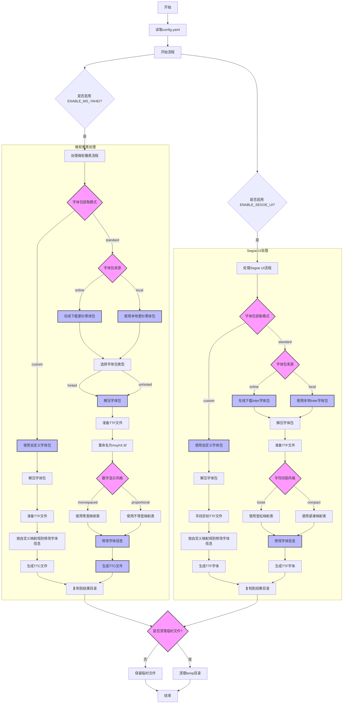

# ZH-Font-Replacement

## 项目简介

自动化生成更佳显示效果的Windows10/11系统中文字体替代方案：

- 以更纱黑体（Sarasa Gothic）为基础，生成伪装的微软雅黑（MS YaHei）
- 以 Inter 为基础，生成伪装的 Segoe UI
- 也可自定义源字体包

本项目仅限开发与测试用途，不得用于商业生产环境。

- [ZH-Font-Replacement](#zh-font-replacement)
  - [项目简介](#项目简介)
  - [项目结构](#项目结构)
  - [流程总览](#流程总览)
  - [环境要求](#环境要求)
  - [依赖安装](#依赖安装)
  - [配置说明](#配置说明)
  - [一键生成流程](#一键生成流程)
  - [主要功能与原理](#主要功能与原理)
  - [设置额外字重生效（Windows）](#设置额外字重生效windows)
  - [更新日志](#更新日志)
  - [注意事项](#注意事项)
  - [License](#license)
  - [免责声明](#免责声明)
  - [致谢](#致谢)
  - [Full Name表](#full-name表)

---

## 项目结构

```
├── main.py               # 主流程入口
├── msyh_workflow.py      # 微软雅黑生成主流程
├── segoe_workflow.py     # Segoe UI 生成主流程
├── msyh_generate.py      # 微软雅黑生成核心脚本
├── segoe_generate.py     # Segoe UI 生成核心脚本
├── fetch_sarasa.py       # Sarasa Gothic 包版本获取、下载与解压
├── fetch_inter.py        # Inter 包版本获取、下载与解压
├── config.yaml           # 主配置文件
├── utils/               # 工具函数集
│   ├── __init__.py      # 模块导出
│   ├── config.py        # 配置管理
│   ├── file_ops.py      # 文件操作
│   ├── archive.py       # 压缩/解压缩
│   ├── font_converter.py # 字体转换
│   ├── result_manager.py # 结果管理
│   ├── cleanup.py       # 清理功能
│   └── progress.py      # 进度显示
├── font_info/           # 字体 name 字段映射与元数据
├── result/              # 生成结果输出目录
├── source_files/        # 字体源包目录
└── temp/               # 临时文件目录
```

---

## 流程总览



---

## 环境要求

- Python >= 3.11.13
- 推荐 Windows

## 依赖安装

```shell
pip install fonttools==4.58.4 py7zr==1.0.0 requests==2.32.4 pyyaml
```

---

## 配置说明

所有配置均由 `config.yaml` 控制：

```yaml
ENABLE_MS_YAHEI: true             # 是否生成微软雅黑（更纱黑体伪装）
ENABLE_SEGOE_UI: true             # 是否生成 Segoe UI（Inter 伪装）
SARASA_VERSION_STYLE: hinted      # Sarasa 包类型：hinted、unhinted
TEMP_DIR: ./temp                  # 临时文件目录
RESULT_DIR: ./result              # 结果输出目录
SOURCE_FILES_DIR: ./source_files  # 字体源文件目录
FONT_PACKAGE_SOURCE: online       # online: 自动下载，local: 仅使用本地包，custom: 使用自定义字体包
DOWNLOAD_TIMEOUT: 60              # 下载超时时间（秒）
CLEAN_TEMP_ON_SUCCESS: true       # 主流程完成后是否自动清理 temp 目录

# 生成的微软雅黑数字风格: monospaced 或 proportional
MS_YAHEI_NUMERALS_STYLE: proportional 

# 生成的Segoe UI 间距风格: loose 或 compact
SEGOE_UI_SPACING_STYLE: compact

# 自定义字体包路径（仅当 FONT_PACKAGE_SOURCE: custom 时生效）
# CUSTOM_MS_YAHEI_PACKAGE: 指定的自定义中文字体包（zip/7z），需放在字体源文件目录
# CUSTOM_SEGOE_PACKAGE: 指定的自定义英文字体包（zip/7z），需放在字体源文件目录
```

- **更纱系列字体**（ SarasaGothicSC、SarasaUiSC）中英文字符外观一致。
  - 在阿拉伯数字上有区别：
    - **不带 `UI` 标识**的是**不等宽设计**（Proportional），即每个字符宽度不同；
    - 而**有 `UI` 标识**的则是**等宽设计**，且数字 **1 的底部多出一横**。

- **Inter 字体**包含两种常见变体：`InterDisplay` 和 `Inter`。两者字符外观一致。
  - 区别在于，**带 `Display` 标识**的排版上会更加紧凑。

- **本地兜底**：如需手动准备字体包，需将以下官方原版字体包放入 `source_files/` 目录，文件名保持原样：

  - Sarasa Gothic：
    - `SarasaGothicSC-TTF-<版本号>.7z` 或 `SarasaGothicSC-TTF-Unhinted-<版本号>.7z`
    - `SarasaUiSC-TTF-<版本号>.7z` 或 `SarasaUiSC-TTF-Unhinted-<版本号>.7z`
    - 推荐优先使用无 `Unhinted` 的包，文件可从 [Sarasa Gothic Releases](https://github.com/be5invis/Sarasa-Gothic/releases) 获取
  - Inter：
    - `Inter-<版本号>.zip`，如 `Inter-4.1.zip`
    - 可从 [Inter Releases](https://github.com/rsms/inter/releases) 获取

  > 注意：
  > - 文件名必须与官方 release 保持一致，否则自动识别会失败。
  > - 只需下载上述压缩包，无需手动解压。

- **在线下载**：在yaml设置 `FONT_PACKAGE_SOURCE: online` 后，将自动下载最新字体包；若本地已有最新版本则跳过

- **自定义字体包**：通过 `FONT_PACKAGE_SOURCE: custom` 设置后，可以使用任意字体包，并指定[自定义映射规则](defualt_custom.template)。

---

## 一键生成流程

主流程入口：

```shell
python main.py
```

- 自动检测配置、准备目录
- 下载/解压 Sarasa Gothic、Inter 字体包
- 生成并伪装微软雅黑/Segoe UI 字体
- 结果输出至 `result/verXX-日期时间/`
- 可选自动清理临时文件

---

## 主要功能与原理

- **高度模块化**：
  - 微软雅黑与 Segoe UI 生成流程完全解耦，风格统一，便于维护和扩展
  - 各自有独立 workflow 文件，主流程统一调度
  - 工具函数按功能分类
- **伪装生成**：
  - 微软雅黑：将 Sarasa SC/UiSC 多字重合成 TTC，批量重命名、替换补全 name 字段
  - Segoe UI：将 Inter 拆分、重命名、批量替换补全 name 字段
- **自动化流程**：
  - 支持本地包与在线下载、解压，自动校验 Sarasa 包哈希
  - 结果目录自动递增，自动生成详细版本报告（含源字体包版本信息）
  - 并行处理支持，提高字体转换效率

---

## 设置额外字重生效（Windows）

如需让极细和半粗字重在 Windows 下生效，请新建 reg 文件，内容如下：

```reg
Windows Registry Editor Version 5.00

[HKEY_LOCAL_MACHINE\SOFTWARE\Microsoft\Windows NT\CurrentVersion\Fonts]
"Microsoft YaHei Xlight & Microsoft YaHei UI Xlight"="msyhxl.ttc"
"Microsoft YaHei Semibold & Microsoft YaHei UI Semibold"="msyhsb.ttc"
```

保存后双击导入，重启生效。

---

## 更新日志

见[CHANGELOG](CHANGELOG.md)

---

## 注意事项

- 需 Python 3.11+，低版本不保证可用
- 字体包下载失败可手动放置至 `source_files/`
- 结果仅供本地开发、测试用途，勿用于商业分发
- 生成的 `version_report.txt` 会自动记录本次用到的 Sarasa/Inter 源包版本号，便于溯源和复现

---

## License

[CC BY-NC-SA 4.0](LICENSE)

---

## 免责声明

- 本项目仅供学习、开发、测试用途，严禁用于任何商业用途或违法用途。
- 所有生成字体均为伪装产物，非官方版本，与 Microsoft、Be5invis、Rasmus Andersson 等原作者无关。
- 使用本项目造成的任何后果，作者概不负责。

---

## 致谢

- [Sarasa Gothic](https://github.com/be5invis/Sarasa-Gothic) 及其作者 Be5invis
- [Inter](https://github.com/rsms/inter) 及其作者 Rasmus Andersson
- [fontTools](https://github.com/fonttools/fonttools) 及相关开源社区
- [otf2ttf](https://github.com/awesometoolbox/otf2ttf) 及其作者 Hexazero
- 以及所有为字体自由与开源生态做出贡献的开发者

---

## Full Name表
>附上FullName(NameID=4, Lang=2052 or Lang=1032)的CSV表参考

```csv
# msyh-Ver6.30
File,Index,Full Names
msyh.ttc,0,微软雅黑
msyh.ttc,1,Microsoft Yahei UI
msyhbd.ttc,0,微软雅黑 Bold
msyhbd.ttc,1,Microsoft Yahei UI Bold
msyhl.ttc,0,微软雅黑 Light
msyhl.ttc,1,Microsoft YaHei UI Light
```

```csv
# msyh-Ver11.3
File,Index,Full Names
msyh.ttc,0,Microsoft YaHei
msyh.ttc,1,Microsoft YaHei UI
msyhbd.ttc,0,Microsoft YaHei Bold
msyhbd.ttc,1,Microsoft YaHei UI Bold
msyhhv.ttc,0,Microsoft YaHei Heavy
msyhhv.ttc,1,Microsoft YaHei UI Heavy
msyhl.ttc,0,Microsoft YaHei Light
msyhl.ttc,1,Microsoft YaHei UI Light
msyhsb.ttc,0,Microsoft YaHei Semibold
msyhsb.ttc,1,Microsoft YaHei UI Semibold
msyhsl.ttc,0,Microsoft YaHei Semilight
msyhsl.ttc,1,Microsoft YaHei UI Semilight
```

```csv
# SegoeUI-Ver5.62
File,Index,Full Names
segoeui.ttf,0,Segoe UI
segoeuib.ttf,0,Segoe UI Bold
segoeuii.ttf,0,Segoe UI Italic
segoeuil.ttf,0,Segoe UI Light
segoeuisl.ttf,0,Segoe UI Semilight
segoeuiz.ttf,0,Segoe UI Bold Italic
seguibl.ttf,0,Segoe UI Black
seguibli.ttf,0,Segoe UI Black Italic
seguili.ttf,0,Segoe UI Light Italic
seguisb.ttf,0,Segoe UI Semibold
seguisbi.ttf,0,Segoe UI Semibold Italic
seguisli.ttf,0,Segoe UI Semilight Italic
```
