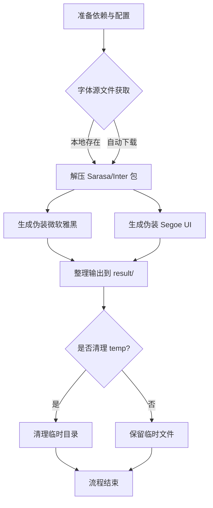

# ZH-Font-Replacement

## 项目简介

自动化生成具有更佳显示效果的系统字体替代方案：

- 以 更纱黑体 -> 微软雅黑 (中文)
- 以 Inter -> Segoe UI (英文)

该项目仅限于开发与测试用途，不得用于商业生产环境。

---

## 目录结构

```
├── auto_all.py           # 主流程入口，一键生成所有字体
├── msyh_generate.py      # 微软雅黑伪装生成核心脚本
├── segoe_generate.py     # Segoe UI 伪装生成核心脚本
├── fetch_sarasa.py       # Sarasa Gothic 包下载与解压
├── fetch_inter.py        # Inter 包下载与解压
├── copy_result.py        # 结果文件整理与输出
├── config.yaml           # 主配置文件
├── font_info/            # 字体 name 字段映射与元数据
├── result/               # 生成结果输出目录
├── source_files/         # 字体源文件目录（本地兜底/自动下载）
├── temp/                 # 临时文件目录
└── ...
```

---

## 流程总览



---

## 环境要求

- Python >= 3.11.13
- 推荐 Windows

## 依赖安装

```shell
pip install fonttools==4.58.4 py7zr==1.0.0 requests==2.32.4 pyyaml
```

---

## 配置说明

所有流程均由 `config.yaml` 控制，示例：

```yaml
ENABLE_MS_YAHEI: true        # 是否生成微软雅黑（更纱黑体伪装）
ENABLE_SEGOE_UI: true        # 是否生成 Segoe UI（Inter 伪装）
TEMP_DIR: ./temp             # 临时文件目录
RESULT_DIR: ./result         # 结果输出目录
SOURCE_FILES_DIR: ./source_files  # 字体源文件目录
DOWNLOAD_MODE: auto          # auto: 自动下载，local: 仅用本地包
SARASA_VERSION: hinted       # Sarasa 包类型：hinted、unhinted
CLEAN_TEMP_ON_SUCCESS: true  # 主流程完成后自动清理 temp
```

- **本地兜底**：如需手动准备字体包，需将以下官方原版字体包放入 `source_files/` 目录，文件名保持原样：

  - Sarasa Gothic：
    - `SarasaGothicSC-TTF-<版本号>.7z` 或 `SarasaGothicSC-TTF-Unhinted-<版本号>.7z`
    - `SarasaUiSC-TTF-<版本号>.7z` 或 `SarasaUiSC-TTF-Unhinted-<版本号>.7z`
    - 推荐优先使用无 `Unhinted` 的包，文件可从 [Sarasa Gothic Releases](https://github.com/be5invis/Sarasa-Gothic/releases) 获取
  - Inter：
    - `Inter-<版本号>.zip`，如 `Inter-4.1.zip`
    - 可从 [Inter Releases](https://github.com/rsms/inter/releases) 获取

  > 注意：
  > - 文件名必须与官方 release 保持一致，否则自动识别会失败。
  > - 只需下载上述压缩包，无需手动解压，脚本会自动处理。
  > - 若只需生成某一类字体，可在 `config.yaml` 关闭对应开关。

- **自动下载**：在yaml设置 `DOWNLOAD_MODE: auto` 后，将自动下载最新字体包；若本地已有最新版本则跳过

---

## 一键生成流程

主流程入口：

```shell
python auto_all.py
```

- 自动检测配置、准备目录
- 下载/解压 Sarasa Gothic、Inter 字体包
- 生成并伪装微软雅黑/Segoe UI 字体
- 结果输出至 `result/verXX-日期时间/`
- 可选自动清理临时文件

---

## 主要功能与原理

- **伪装生成**：
  - 微软雅黑：将 Sarasa SC/UiSC 多字重合成 TTC，批量重命名、替换补全 name 字段
  - Segoe UI：将 Inter 拆分、重命名、批量替换补全 name 字段
- **自动化流程**：
  - 支持本地包与在线下载、解压
  - 结果目录自动递增

---

## 注意事项

- 需 Python 3.11+，低版本不保证可用
- 字体包下载失败可手动放置至 `source_files/`
- 结果仅供本地开发、测试用途，勿用于商业分发

---

## License

[CC BY-NC-SA 4.0](LICENSE)

---

## 免责声明

- 本项目仅供学习、开发、测试用途，严禁用于任何商业用途或违法用途。
- 所有生成字体均为伪装产物，非官方版本，与 Microsoft、Be5invis、Rasmus Andersson 等原作者无关。
- 使用本项目造成的任何后果，作者概不负责。

## 致谢

- [Sarasa Gothic](https://github.com/be5invis/Sarasa-Gothic) 及其作者 Be5invis
- [Inter](https://github.com/rsms/inter) 及其作者 Rasmus Andersson
- [fontTools](https://github.com/fonttools/fonttools) 及相关开源社区
- 以及所有为字体自由与开源生态做出贡献的开发者