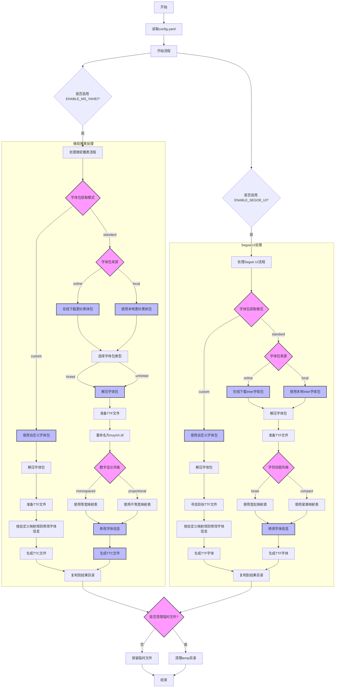

# ZH-Font-Replacement

## 背景

最近一次 Windows 更新后，系统 UI 字体意外恢复到了默认的微软雅黑字体。此前我一直使用"等距更纱黑体替换微软雅黑"方案，该方案基于更纱黑体改进而来。虽然原作者分享的文件仍保存在我的本地，但考虑到更纱黑体可能已多次更新，我需要新版替换包。

在寻找解决方案的过程中，我发现项目 [yahei-sarasa](https://github.com/chenh96/yahei-sarasa) 通过 Github API 获取最新版更纱黑体来构建微软雅黑字体，这一思路给了我很大启发。于是我 fork 了该项目并进行修改，但后续实践中发现偏离预期效果，且原项目使用 FontForge 在 Windows 环境调用不便，因此决定彻底重写并解除 fork 关系。

在重写过程中，我提取了原版微软雅黑的 NAME 元信息（中英双语）存储为 JSON 格式，并借鉴"等距更纱完美替换微软雅黑"方案补充了斜体元数据。原版 msyh.ttc 只包含两个常规 ttf，我增加了 2 个对应的斜体。

目前项目只做了元数据改写工作，因为我不会具体的字形优化。

## 项目简介

本项目用于追踪最新版本Release，自动生成**替换** Windows 10/11 的默认字体文件（微软雅黑、Segoe UI）。

## 主要功能

-   基于 **更纱黑体** 生成微软雅黑字体文件。
-   基于 **Inter** 生成Segoe UI字体文件。
-   可自定义其他字体包作为生成基础。


## 重要须知

> [!CAUTION]
> 字体替换存在风险，请确保具备相关知识和实操能力
> 
> 本项目生成的文件**仅限用于开发与测试环境**。
> 
> **严禁在生产环境或日常中使用！**
> 
> 
> **本项目不提供替换教程或自动化替换功能。**
>
>  **你需要自行查找教程并手动替换**系统的原始字体文件。


- [ZH-Font-Replacement](#zh-font-replacement)
  - [背景](#背景)
  - [项目简介](#项目简介)
  - [主要功能](#主要功能)
  - [重要须知](#重要须知)
  - [项目结构](#项目结构)
  - [流程总览](#流程总览)
  - [环境要求](#环境要求)
  - [依赖安装](#依赖安装)
  - [配置说明](#配置说明)
  - [字体包说明](#字体包说明)
  - [使用说明](#使用说明)
  - [设置额外字重生效（Windows）](#设置额外字重生效windows)
  - [更新日志](#更新日志)
  - [注意事项](#注意事项)
  - [License](#license)
  - [声明](#声明)
  - [致谢](#致谢)
  - [Full Name表](#full-name表)


---

## 项目结构

```
├── main.py               # 主流程入口
├── msyh_workflow.py      # 微软雅黑生成主流程
├── segoe_workflow.py     # Segoe UI 生成主流程
├── msyh_generate.py      # 微软雅黑生成核心脚本
├── segoe_generate.py     # Segoe UI 生成核心脚本
├── fetch_sarasa.py       # Sarasa Gothic 包版本获取、下载与解压
├── fetch_inter.py        # Inter 包版本获取、下载与解压
├── config.yaml           # 主配置文件
├── docs                  # 文档
├── utils/               # 工具函数集
│   ├── __init__.py      # 模块导出
│   ├── config.py        # 配置管理
│   ├── file_ops.py      # 文件操作
│   ├── archive.py       # 压缩/解压缩
│   ├── font_converter.py # 字体转换
│   ├── result_manager.py # 结果管理
│   ├── cleanup.py       # 清理功能
│   └── progress.py      # 进度显示
├── font_info/           # 字体 name 字段映射与元数据
├── result/              # 生成结果输出目录
├── source_files/        # 字体源包目录
└── temp/               # 临时文件目录
```

---

## 流程总览



---

## 环境要求

- Python >= 3.11.13
- 推荐 Windows

## 依赖安装

```shell
pip install fonttools==4.58.4 py7zr==1.0.0 requests==2.32.4 pyyaml
```

---

## 配置说明

>[!IMPORTANT]
所有配置均由 [config.yaml](config.yaml) 控制。

## 字体包说明

- **更纱系列字体**（ SarasaGothicSC、SarasaUiSC）中英文字符外观一致。
  - 在阿拉伯数字上有区别：
    - **`Gothic` 标识**的是**不等宽设计**（Proportional），即每个字符宽度不同；
    - **`UI` 标识**的则是**等宽设计**，且数字 1 的底部多出一横。

- **Inter 字体**包含两种常见变体：`InterDisplay` 和 `Inter`。两者字符外观一致。
  - 区别在于，**带 `Display` 标识**的排版上会更加紧凑。

- **local 模式**：如使用 `FONT_PACKAGE_SOURCE: local` ，需将以下官方原版字体包放入 `source_files/` 目录，文件名保持原样：

  - Sarasa Gothic：
    - `SarasaGothicSC-TTF-<版本号>.7z` 或 `SarasaGothicSC-TTF-Unhinted-<版本号>.7z`
    - `SarasaUiSC-TTF-<版本号>.7z` 或 `SarasaUiSC-TTF-Unhinted-<版本号>.7z`
    - 推荐优先使用没有 `Unhinted` 标识的包，文件可从 [Sarasa Gothic Releases](https://github.com/be5invis/Sarasa-Gothic/releases) 获取
  - Inter：
    - `Inter-<版本号>.zip`，如 `Inter-4.1.zip`
    - 可从 [Inter Releases](https://github.com/rsms/inter/releases) 获取

> [!NOTE]  
  >
  >> 只需下载上述压缩包，无需手动解压。
  >>
  >> 文件名必须与官方 release 保持一致，否则自动识别会失败。

- **在线下载**：在yaml设置 `FONT_PACKAGE_SOURCE: online` 后，将自动下载最新字体包；若本地已有最新版本则跳过

- **自定义字体包**：通过 `FONT_PACKAGE_SOURCE: custom` 设置后，可以使用任意字体包，并指定[自定义映射规则](docs/defualt_custom.template)。

---

## 使用说明

1. 克隆项目
```shell
git clone https://github.com/ReRokutosei/ZH-Font-Replacement.git
cd 'ZH-Font-Replacement'
```

2. [前往 yaml 文件调整配置](config.yaml)

3. 执行作业
```shell
python main.py
```
  - 作业过程：
    - 自动检测配置、准备目录
    - 下载/解压 Sarasa Gothic、Inter 字体包
    - 生成并伪装微软雅黑/Segoe UI 字体
    - 结果输出至 `result/verXX-日期时间/`
    - 可选自动清理临时文件
---

## 设置额外字重生效（Windows）

如需让极细和半粗字重在 Windows 下生效，请新建 reg 文件，内容如下：

>[!CAUTION]
>修改注册表前请备份
>
>操作不当可能导致系统问题

```reg
Windows Registry Editor Version 5.00

[HKEY_LOCAL_MACHINE\SOFTWARE\Microsoft\Windows NT\CurrentVersion\Fonts]
"Microsoft YaHei Xlight & Microsoft YaHei UI Xlight"="msyhxl.ttc"
"Microsoft YaHei Semibold & Microsoft YaHei UI Semibold"="msyhsb.ttc"
```

保存后双击导入，重启生效。

与字体相关的注册表项，可参考[registry](docs/registry.md)

---

## 更新日志

见[CHANGELOG](CHANGELOG.md)

---

## 注意事项

- 需 Python 3.11+，低版本不保证可用
- 字体包下载失败可手动放置至 `source_files/`
- 结果仅供本地开发、测试用途，勿用于商业分发
- 生成的 `version_report.txt` 会自动记录本次用到的 Sarasa/Inter 源包版本号，便于溯源和复现

---

## License

[CC BY-NC-SA 4.0](LICENSE)

---

## 声明
>[!CAUTION]
>
> **免责声明**
> 
> 使用前请务必仔细阅读各项说明。
> 
> 使用本项目造成的任何后果，作者概不负责。
> 
> 本项目仅供学习、开发、测试用途，严禁用于任何商业用途或违法用途。
>
> 他人使用本项目所造成的一切不良后果，不由项目作者承担，请向使用者追究全部责任
> 
> 所有生成字体均为伪装产物，非官方版本，与 Microsoft 原作者无关。

> [!CAUTION]
> **法律风险提示**
> 
> 本项目生成的字体文件可能涉及第三方知识产权（包括但不限于商标权、版权等）。
> 
> 特别是生成的伪装成"微软雅黑"和"Segoe UI"的字体文件可能涉及微软公司的知识产权。
> 
> 使用这些字体文件可能面临法律风险，包括但不限于商标侵权、版权侵权等指控。
> 
> **强烈建议：**
> 1. 仅在个人学习、研究目的下使用本工具
> 2. 不要将生成的字体文件用于商业用途
> 3. 不要在公开场合分发生成的字体文件
> 4. 使用前请自行评估可能的法律风险

> [!NOTE]
> **关于字体元数据信息**
>
> 本项目 `font_info` 目录中包含的 JSON 文件仅包含从公开可获取的字体文件中提取的元数据信息，
> 如字体名称、版本号、版权信息等。这些信息用于指导生成过程，而非分发受版权保护的字体数据。
>
> 这些元数据信息可以通过标准字体工具从任何已安装的字体中提取，其本身不包含任何创造性的表达或受版权保护的内容。
>
> 项目不包含任何实际的字体轮廓数据、字形信息或其他受版权保护的字体内容。

---

## 致谢

- [Sarasa Gothic](https://github.com/be5invis/Sarasa-Gothic) 及其作者 Be5invis
- [Inter](https://github.com/rsms/inter) 及其作者 Rasmus Andersson
- [fontTools](https://github.com/fonttools/fonttools) 及相关开源社区
- [otf2ttf](https://github.com/awesometoolbox/otf2ttf) 及其作者 Hexazero
- 以及所有为字体自由与开源生态做出贡献的开发者

---

## Full Name表
>[!TIP]
>附上Full Name的CSV表参考
>
> (NameID=4, Lang=2052 or Lang=1032)

```csv
# msyh-Ver6.30
File,Index,Full Names
msyh.ttc,0,微软雅黑
msyh.ttc,1,Microsoft Yahei UI
msyhbd.ttc,0,微软雅黑 Bold
msyhbd.ttc,1,Microsoft Yahei UI Bold
msyhl.ttc,0,微软雅黑 Light
msyhl.ttc,1,Microsoft YaHei UI Light
```

```csv
# msyh-Ver11.3
File,Index,Full Names
msyh.ttc,0,Microsoft YaHei
msyh.ttc,1,Microsoft YaHei UI
msyhbd.ttc,0,Microsoft YaHei Bold
msyhbd.ttc,1,Microsoft YaHei UI Bold
msyhhv.ttc,0,Microsoft YaHei Heavy
msyhhv.ttc,1,Microsoft YaHei UI Heavy
msyhl.ttc,0,Microsoft YaHei Light
msyhl.ttc,1,Microsoft YaHei UI Light
msyhsb.ttc,0,Microsoft YaHei Semibold
msyhsb.ttc,1,Microsoft YaHei UI Semibold
msyhsl.ttc,0,Microsoft YaHei Semilight
msyhsl.ttc,1,Microsoft YaHei UI Semilight
```

```csv
# SegoeUI-Ver5.62
File,Index,Full Names
segoeui.ttf,0,Segoe UI
segoeuib.ttf,0,Segoe UI Bold
segoeuii.ttf,0,Segoe UI Italic
segoeuil.ttf,0,Segoe UI Light
segoeuisl.ttf,0,Segoe UI Semilight
segoeuiz.ttf,0,Segoe UI Bold Italic
seguibl.ttf,0,Segoe UI Black
seguibli.ttf,0,Segoe UI Black Italic
seguili.ttf,0,Segoe UI Light Italic
seguisb.ttf,0,Segoe UI Semibold
seguisbi.ttf,0,Segoe UI Semibold Italic
seguisli.ttf,0,Segoe UI Semilight Italic
```
