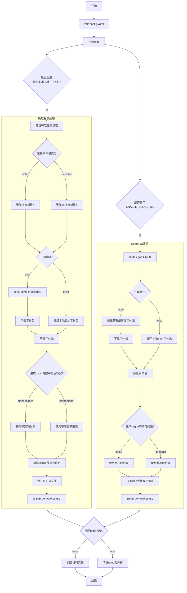

# ZH-Font-Replacement

## 项目简介


自动化生成更佳显示效果的系统字体替代方案：

- 以更纱黑体（Sarasa Gothic）为基础，生成伪装的微软雅黑（MS YaHei）
- 以 Inter 为基础，生成伪装的 Segoe UI

本项目仅限开发与测试用途，不得用于商业生产环境。

---

## 目录结构

```
├── main.py               # 主流程入口
├── project_utils.py      # 通用工具与目录/报告
├── msyh_workflow.py      # 微软雅黑生成主流程
├── segoe_workflow.py     # Segoe UI 生成主流程
├── msyh_generate.py      # 微软雅黑生成核心脚本
├── segoe_generate.py     # Segoe UI 生成核心脚本
├── fetch_sarasa.py       # Sarasa Gothic 包版本获取、下载与解压
├── fetch_inter.py        # Inter 包版本获取、下载与解压
├── copy_result.py        # 结果文件整理与输出
├── config.yaml           # 主配置文件
├── font_info/            # 字体 name 字段映射与元数据
├── result/               # 生成结果输出目录
├── source_files/         # 字体源文件目录（本地兜底/自动下载）
├── temp/                 # 临时文件目录
└── ...
```

---

## 流程总览



---

## 环境要求

- Python >= 3.11.13
- 推荐 Windows

## 依赖安装

```shell
pip install fonttools==4.58.4 py7zr==1.0.0 requests==2.32.4 pyyaml
```

---

## 配置说明

所有流程均由 `config.yaml` 控制，示例：

```yaml
ENABLE_MS_YAHEI: true        # 是否生成微软雅黑（更纱黑体伪装）
ENABLE_SEGOE_UI: true        # 是否生成 Segoe UI（Inter 伪装）
TEMP_DIR: ./temp             # 临时文件目录
RESULT_DIR: ./result         # 结果输出目录
SOURCE_FILES_DIR: ./source_files  # 字体源文件目录
DOWNLOAD_MODE: auto          # auto: 自动下载，local: 仅用本地包
SARASA_VERSION_STYLE: hinted       # Sarasa 包类型：hinted、unhinted
CLEAN_TEMP_ON_SUCCESS: true  # 主流程完成后自动清理 temp
```

- **本地兜底**：如需手动准备字体包，需将以下官方原版字体包放入 `source_files/` 目录，文件名保持原样：

  - Sarasa Gothic：
    - `SarasaGothicSC-TTF-<版本号>.7z` 或 `SarasaGothicSC-TTF-Unhinted-<版本号>.7z`
    - `SarasaUiSC-TTF-<版本号>.7z` 或 `SarasaUiSC-TTF-Unhinted-<版本号>.7z`
    - 推荐优先使用无 `Unhinted` 的包，文件可从 [Sarasa Gothic Releases](https://github.com/be5invis/Sarasa-Gothic/releases) 获取
  - Inter：
    - `Inter-<版本号>.zip`，如 `Inter-4.1.zip`
    - 可从 [Inter Releases](https://github.com/rsms/inter/releases) 获取

  > 注意：
  > - 文件名必须与官方 release 保持一致，否则自动识别会失败。
  > - 只需下载上述压缩包，无需手动解压，脚本会自动处理。
  > - 若只需生成某一类字体，可在 `config.yaml` 关闭对应开关。

- **自动下载**：在yaml设置 `DOWNLOAD_MODE: auto` 后，将自动下载最新字体包；若本地已有最新版本则跳过

---

## 一键生成流程

主流程入口：

```shell
python main.py
```

- 自动检测配置、准备目录
- 下载/解压 Sarasa Gothic、Inter 字体包
- 生成并伪装微软雅黑/Segoe UI 字体
- 结果输出至 `result/verXX-日期时间/`
- 可选自动清理临时文件

---

## 主要功能与原理

- **高度模块化**：
  - 微软雅黑与 Segoe UI 生成流程完全解耦，风格统一，便于维护和扩展
  - 各自有独立 workflow 文件，主流程统一调度
- **伪装生成**：
  - 微软雅黑：将 Sarasa SC/UiSC 多字重合成 TTC，批量重命名、替换补全 name 字段
  - Segoe UI：将 Inter 拆分、重命名、批量替换补全 name 字段
- **自动化流程**：
  - 支持本地包与在线下载、解压，自动校验 Sarasa 包哈希
  - 结果目录自动递增，自动生成详细版本报告（含源字体包版本信息）

---

## 设置额外字重生效（Windows）

如需让极细和半粗字重在 Windows 下生效，请新建 reg 文件，内容如下：

```reg
Windows Registry Editor Version 5.00

[HKEY_LOCAL_MACHINE\SOFTWARE\Microsoft\Windows NT\CurrentVersion\Fonts]
"Microsoft YaHei Xlight & Microsoft YaHei UI Xlight"="msyhxl.ttc"
"Microsoft YaHei Semibold & Microsoft YaHei UI Semibold"="msyhsb.ttc"
```

保存后双击导入，重启生效。

---


## 注意事项

- 需 Python 3.11+，低版本不保证可用
- 字体包下载失败可手动放置至 `source_files/`
- 结果仅供本地开发、测试用途，勿用于商业分发
- 生成的 `version_report.txt` 会自动记录本次用到的 Sarasa/Inter 源包版本号，便于溯源和复现

---

## License

[CC BY-NC-SA 4.0](LICENSE)

---

## 免责声明

- 本项目仅供学习、开发、测试用途，严禁用于任何商业用途或违法用途。
- 所有生成字体均为伪装产物，非官方版本，与 Microsoft、Be5invis、Rasmus Andersson 等原作者无关。
- 使用本项目造成的任何后果，作者概不负责。

## 致谢

- [Sarasa Gothic](https://github.com/be5invis/Sarasa-Gothic) 及其作者 Be5invis
- [Inter](https://github.com/rsms/inter) 及其作者 Rasmus Andersson
- [fontTools](https://github.com/fonttools/fonttools) 及相关开源社区
- 以及所有为字体自由与开源生态做出贡献的开发者